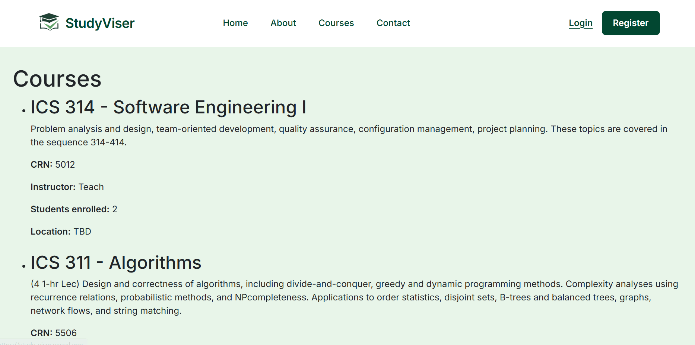
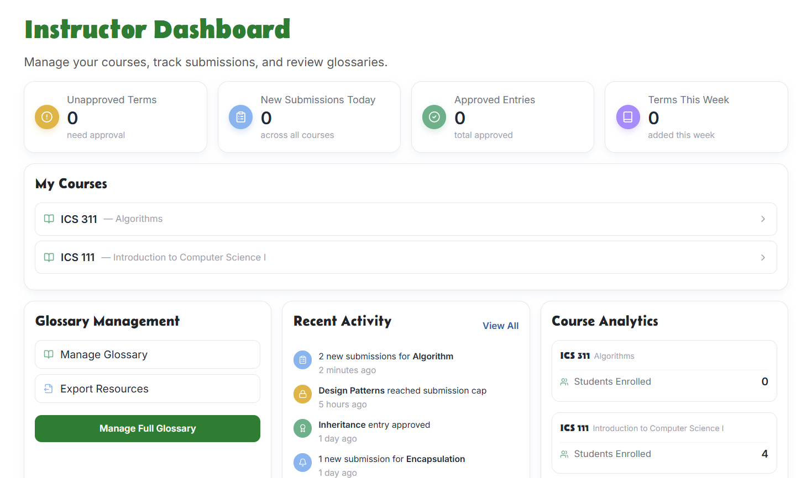
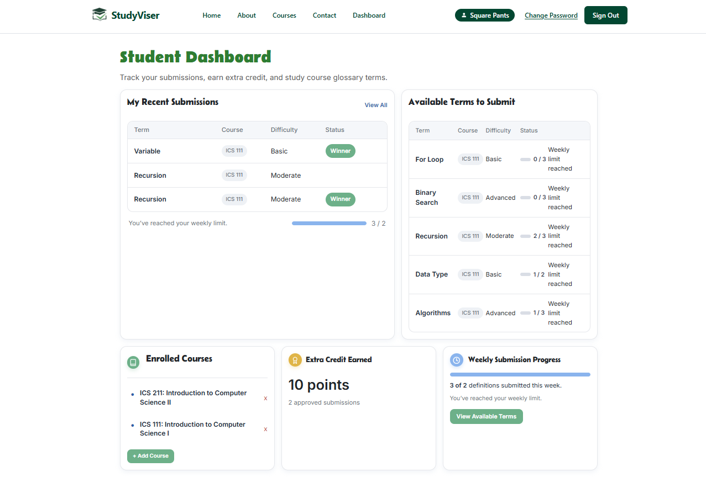
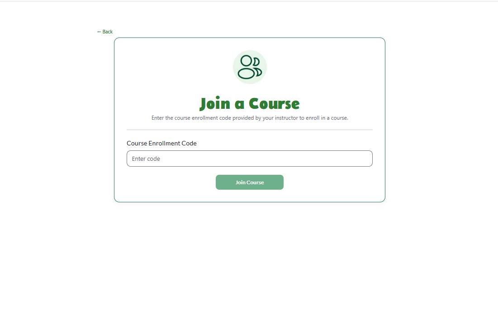
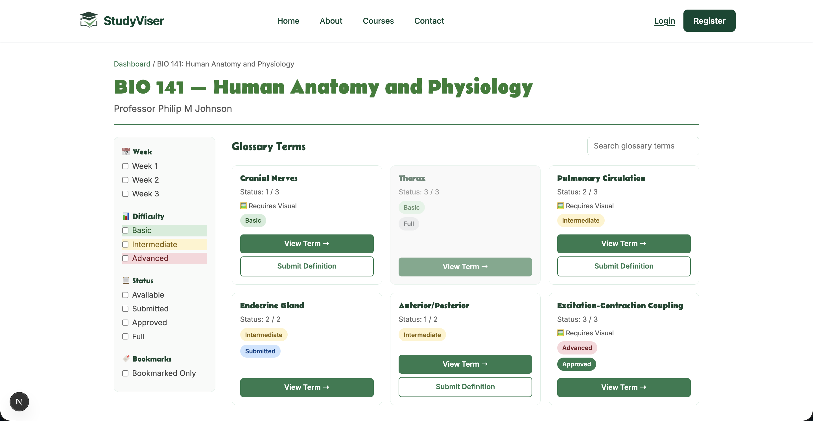
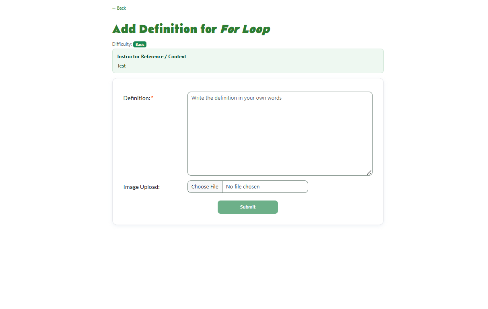
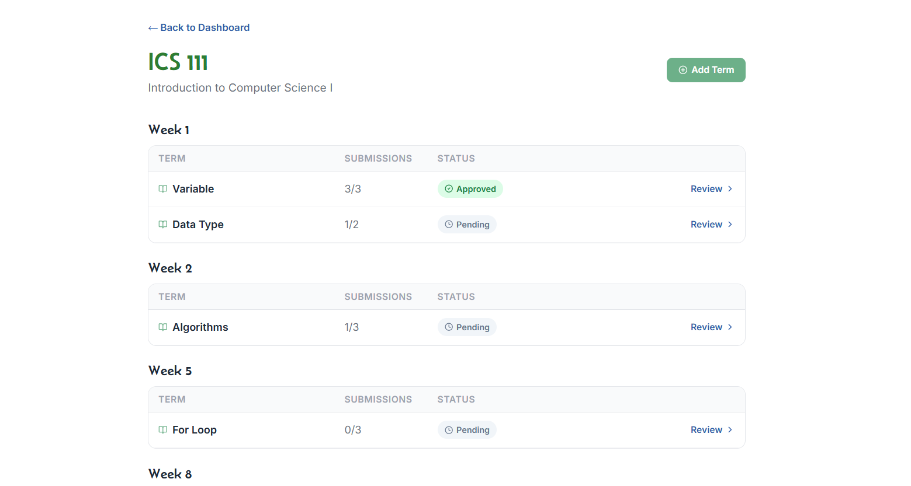
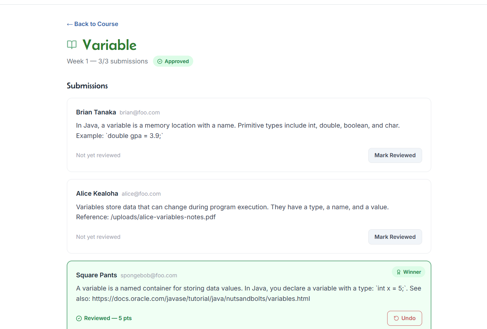

## Project: StudyViser

## Members
* Asano, Noah
* Gillan, Michaela
* Kim, Seonwoo
* Valera, Khloe
* Wong, Marie

## Deployments
* [https://study-viser.github.io/](https://study-viser.vercel.app/)

## Team Contract
[Contract Document](https://docs.google.com/document/d/1WNb_lyYdNFqCcCuSS1j-lI2dNDbnwPH-kORr4O0ziu0/edit?tab=t.0)

## Github Organization
[Study-viser Organization](https://github.com/study-viser)

## Current Project Updates

## Milestone 1
[Milestone 1 Github Project](https://github.com/orgs/study-viser/projects/1)

## Milestone 2
[Milestone 2 Github Project](https://github.com/orgs/study-viser/projects/4/views/1)

## Overview

**The problem:** Students struggle to access structured, verified study materials tailored to their specific courses. Each course has different learning needs—some courses require mastering terminology, others need worked problem solutions, analyses, or concepts. Currently, students piece together study resources from various sources (textbooks, lecture notes, online forums) without quality assurance or institutional verification. Additionally, students don't know what to expect from a course before enrolling.

**The solution:** StudyViser is a collaborative platform where instructors define what study materials their course needs, and students earn extra credit by submitting, reviewing, and refining those materials. All approved submissions compile into comprehensive, interactive study resources organized by topic. By enabling cross-course sharing and open resource exports, StudyViser becomes a community-driven resource that benefits current and future students across disciplines.

## Approach

StudyViser has three main user roles: students, instructors, and teaching assistants (TAs). Any user can have multiple roles (for example, a graduate student can be both a TA and a student in a different course).

**Instructors** create course study material structures by defining what types of content their course needs (starting with glossary terms in Phase 1). They set extra credit point values for contributions, control whether students can access previous semester materials, and export compiled resources as open educational resources.

**Teaching Assistants (TAs)** select the highest-quality student submissions and approve them for the glossary. They can view and provide feedback on the selection process.

**Students** enroll in courses, view study materials, and strategically submit content for assigned course topics. Students earn extra credit for having their submission selected as the approved glossary entry. They study interactively by highlighting, annotating, and bookmarking materials. If the instructor allows, students can access previous semester materials to understand course expectations before enrolling.

## Phase 1: Glossary-Based Study Materials (MVP)

For the initial implementation, StudyViser focuses on **terminology and definitions.**.

**Instructor-Defined Glossaries:**
- Instructor adds terms for each week or topic
- Optionally marks terms as requiring visual annotation
- Provides optional reference definitions or context

**Student Submissions & Competition:**
- Students can submit definitions for glossary terms
- **Per-Student Limit:** Each student can submit 1-2 definitions per week maximum (at instructor's discretion)
- **Per-Term Cap (based on class size):** Each term can receive multiple submissions for competition:
  - 1-20 students: 3 submissions per term max
  - 21-40 students: 4 submissions per term max
  - 41+ students: 5 submissions per term max
- Once a term reaches its submission cap, no more submissions are accepted for that term that week
- This creates a choice: students must decide which terms to attempt based on difficulty, competition level, and their strengths
- Ensures all glossary terms receive attention and have quality submissions to choose from

**Submission Content:**
- Text definition written in the student's own words
- Optional: Upload visual annotations (labeled diagrams, sketches, annotated images)
- Optional: Add examples or relate to other terms
- Designate difficulty level (Basic / Intermediate / Advanced)

**Competitive Review & Approval Process:**
- All submissions are visible to the class as reference materials
- **TA/Instructor selects the highest-quality submission** based on:
  - Accuracy and completeness
  - Clarity and pedagogical value
  - Visual annotations quality (if applicable)
  - Overall helpfulness as a study resource
- Only the approved submission is added to the official glossary
- Only the student whose definition was selected earns extra credit (3-5 points typical, varies by quality)
- Other submissions remain visible as supplementary resources but don't earn credit, allowing students to learn from multiple approaches

**Interactive Study Features:**
- Highlight key phrases (color-coded for personal use)
- Add private annotations to any term
- Bookmark important terms
- Create custom study sets
- Use flashcard study mode
- Search and filter by week, difficulty, or content type
- View multiple submitted definitions (approved and unapproved) to understand different approaches

## Mockup Page Ideas

Some possible mockup pages include:

- Landing Page / Home Page
- Login / Register (with role selection: student, instructor, TA)
- Student Dashboard
- Instructor Dashboard
- TA Dashboard
- Course Study Resource View
- Glossary Term View (showing all submissions and ratings)
- Student Submission Form (text + image upload)
- TA Selection Interface (choosing the best submission)
- Interactive Study Material (with highlighting and annotation tools)
- Previous Semester Materials View
- Student Profile (submission history, extra credit balance)
- Resource Export Modal
- Course Analytics Page
